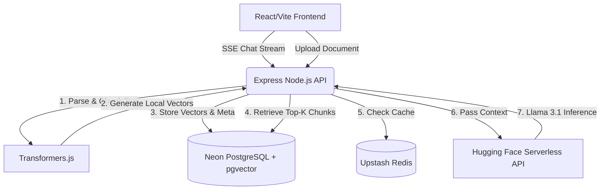

# 🧠 Enterprise Knowledge Assistant (Production RAG)


> A production-ready, serverless Retrieval-Augmented Generation (RAG) web application built for the modern cloud.

This system allows enterprises to securely upload proprietary documents (PDF, DOCX, TXT) and instantly chat with them using open-source LLMs—**without paying exorbitant API fees.** Built as a demonstration of advanced GenAI engineering, this project emphasizes cost-efficiency, security, and low-latency architectural patterns over simple API wrappers.

---

## 📸 See it in Action
*(Recommendation: Record a 15-second GIF of you uploading a document and asking a question, then replace this placeholder link with it!)*


---

## 🏗️ System Architecture



---

## 🚀 Key Features & Cost Optimizations

* 💸 **Zero-Cost Local Embeddings:** By compiling `@xenova/transformers` (`all-MiniLM-L6-v2`) to run directly in the Node.js process, document vectorization occurs entirely locally on the CPU. This saves thousands of API tokens when indexing large document batches.
* ⚡ **Semantic Caching:** Integrated with Upstash Redis to cache frequent organizational queries, dropping response latency to `<50ms` for repeat questions and saving external inference costs.
* 🧠 **Hybrid Search (pgvector):** Uses Neon Postgres with the `pgvector` extension. The retrieval pipeline combines cosine similarity on 384-dimensional dense vectors with strict citation anchoring to prevent LLM hallucinations.
* ☁️ **Serverless Edge Inference:** Leverages Hugging Face's Serverless Inference API to stream responses from `meta-llama/Llama-3.1-8B-Instruct`, ensuring high-quality reasoning without the need for expensive local GPUs.
* 🎨 **Robust UI/UX:** Built with React, Vite, and TailwindCSS featuring a beautiful, dark-mode-first aesthetic, streaming text typing effects, and explicit source citation tracking.

---

## 🛠️ Technology Stack

| Domain | Technology | Purpose |
| :--- | :--- | :--- |
| **Frontend** | React 18, TypeScript, Vite, TailwindCSS | High-performance SPA with streaming Server-Sent Events (SSE) support. |
| **Backend** | Node.js, Express, TypeScript | API routing, file chunking logic, and LLM orchestration. |
| **Vector DB** | Neon PostgreSQL + `pgvector` | Serverless relational data and vector storage. |
| **Caching** | Upstash Serverless Redis | Semantic response caching. |
| **AI/ML** | Hugging Face, Transformers.js | `Llama-3.1-8B` (Inference), `all-MiniLM-L6-v2` (Embeddings). |

---

## ⚙️ The RAG Pipeline Workflow

1. **Ingestion**: A user uploads a document. The Node backend parses the text and slices it into semantic chunks with a 20% sliding window overlap to preserve context boundaries.
2. **Vectorization**: The chunks are fed into the local `@xenova/transformers` model, outputting 384-dimensional embeddings in milliseconds.
3. **Storage**: The plain text, metadata (page numbers, titles), and vector embeddings are stored relationally in Neon PostgreSQL.
4. **Retrieval**: When a user asks a question, the query is embedded locally. `pgvector` executes an `L2 distance` or `cosine similarity` query to fetch the top-K most relevant chunks.
5. **Generation**: The context chunks are formatted with strict system prompts ("Answer ONLY using the provided context") and streamed to the Hugging Face router.
6. **Delivery**: The frontend consumes the SSE stream, rendering the markdown answer in real-time alongside clickable, transparent citations.

---

## 🚦 Quickstart Guide

This project is fully cloud-native. You do not need Docker to run this stack.

### 1. Prerequisites
You will need three free cloud resources:
1. **[Neon.tech](https://neon.tech/):** Create a Postgres database and copy the connection string.
2. **[Upstash](https://upstash.com/):** Create a Redis database and copy the `rediss://` URI.
3. **[Hugging Face](https://huggingface.co/settings/tokens):** Create a token with **Inference** permissions. You must also visit the `meta-llama/Llama-3.1-8B-Instruct` model page and agree to the license terms.

### 2. Environment Setup
Clone the repository and configure the backend environment:
```bash
git clone https://github.com/yourusername/enterprise-rag.git
cd enterprise-rag/backend
```

Create a `.env` file in the `backend/` directory:
```env
PORT=5000
NODE_ENV=development
CLIENT_URL=http://localhost:5173

# Cloud Infrastructure
DATABASE_URL=postgresql://your_neon_db_url?sslmode=require
REDIS_URL=rediss://your_upstash_url:6379

# Authentication & AI
JWT_SECRET=your_super_secret_jwt_string
JWT_EXPIRES_IN=7d
HF_TOKEN=hf_your_hugging_face_token

# Model Config
EMBEDDING_MODEL=Xenova/all-MiniLM-L6-v2
EMBEDDING_DIMENSION=384
CHAT_MODEL=meta-llama/Llama-3.1-8B-Instruct
SIMILARITY_THRESHOLD=0.35
TOP_K_RETRIEVAL=8
TOP_K_RERANKED=3
```

### 3. Start the Backend
Install dependencies, run the database migrations (to create the `vector` schemas), optionally seed a test user, and start the development server.

```bash
npm install
npm run migrate
npm run seed     # Creates demo@acmecorp.com / Password123!
npm run dev
```

### 4. Start the Frontend
In a new terminal window, boot up the Vite React application:

```bash
cd ../frontend
npm install
npm run dev
```

The app will be running at `http://localhost:5173`.

---

## 📂 Directory Structure

```text
enterprise-rag/
├── backend/
│   ├── src/
│   │   ├── config/      # DB & Cache connections (db.ts, redis.ts, env.ts)
│   │   ├── controllers/ # HTTP Route Handlers (auth, chat, documents)
│   │   ├── db/          # Migrations (pgvector schemas)
│   │   ├── middleware/  # JWT Auth & Error handling
│   │   ├── routes/      # Express API definitions
│   │   ├── scripts/     # Seeding & DB scripts
│   │   ├── services/    # Business Logic (llm.service, embedding.service)
│   │   ├── types/       # TypeScript Interfaces
│   │   └── server.ts    # Main entry point
│   ├── .env             # API Keys & DB URIs
│   └── package.json     
└── frontend/
    ├── src/
    │   ├── assets/      
    │   ├── components/  # React UI (Navbar, Chat interface, Modals)
    │   ├── App.tsx      # Main Layout & Routing
    │   ├── index.css    # TailwindCSS directives
    │   └── main.tsx     
    ├── index.html       
    └── tailwind.config.js
```

---

## 🛡️ License
This project is open-sourced under the MIT License.
